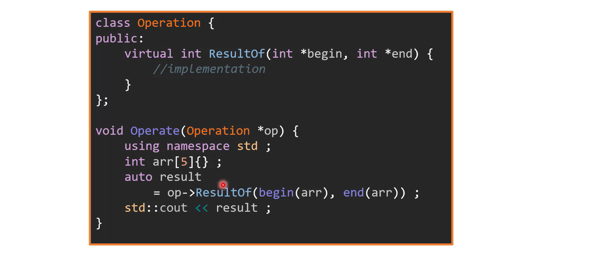

[TOC]

# UML

## class

 

## inheritance

## composition

## aggregation

## association

## note

# principles

## single responsibility principle

每个类只能有一个职责

以上例子违反了单一职责原则，应将显示拆分为单独的类

## open-closed principle

不需要修改便可以更改现有代码行为，对于类的更改应添加新的代码而不是更改旧代码，会造成程序bugs与隐患。  

对于add()方法的修改，应将原有函数改为虚函数，继承该类并重写add方法

## Liskov-Substitution principle

子类的行为基类需要有，不能改变父类的行为

添加ResultOf处理bool类型变量

